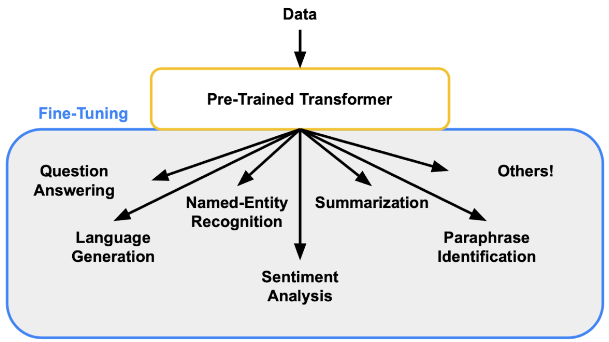

# Fine-Tuning

## [The Ultimate Guide to LLM Fine Tuning: Best Practices & Tools](https://www.lakera.ai/blog/llm-fine-tuning-guide)

**¿Qué es el fine-tuning?**

El ajuste fino (fine-tuning) del modelo es un proceso en el que un modelo previamente entrenado, que ya ha aprendido algunos patrones y características en un gran conjunto de datos, se entrena aún más ("se afina") en un conjunto de datos más pequeño y específico de un dominio.

**¿Cuándo necesitamos hace fine-tuning?**

El ajuste de modelos es crucial en el aprendizaje automático cuando se desea adaptar un modelo preexistente a una tarea o dominio específico.

Ecenarios en los que es necesario:

* Transferencia de aprendizaje.
* Disponibilidad limitada de datos.
* Eficiencia de tiempo y recursos.
* Adaptación de tareas específicas.
* Aprendizaje continuo.
* Mitigación de sesgos.
* Seguridad y cumplimiento de datos.

El ajuste es un paso crucial para mejorar los modelos de lenguajes grandes (LLM) a través del aprendizaje por transferencia. Implica ajustar los parámetros de un LLM con datos específicos de la tarea, manteniendo su conocimiento de formación original.

---

## Relación con LLM Security

El Fine-Tuning puede aumentar la vulnerabilidad de los LLM a los ataques de seguridad. Esto se debe a que el fine-tuning puede causar que el modelo aprenda patrones en los datos de entrenamiento que pueden ser utilizados por los atacantes para explotar el modelo.

**Algunos ejemplos de desafíos de seguridad asociados con el fine-tuning incluyen:**

* Ataques de inyección de indicaciones: Los atacantes pueden intentar inyectar indicaciones maliciosas en los datos de entrenamiento para que el modelo aprenda patrones que puedan ser utilizados para realizar ataques, como ataques de phishing o de malware.
* Fugas de datos: Los datos utilizados para el fine-tuning pueden contener información sensible que puede ser robada por los atacantes.
* Acceso no autorizado: Los atacantes pueden intentar acceder al modelo o a los datos utilizados para el fine-tuning sin autorización.
<>