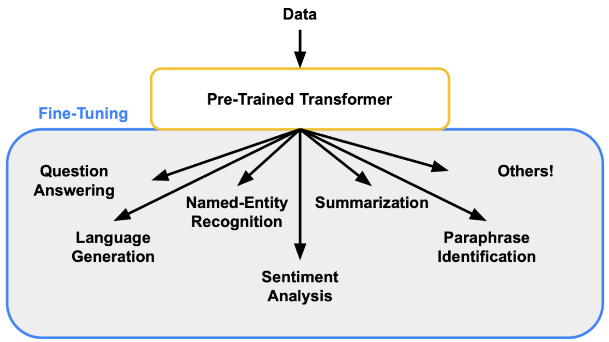

# LLM

Un modelo de lenguaje de gran tamaño (LLM) es un modelo de aprendizaje automático que ha sido entrenado en un conjunto de datos masivo de texto y código. Los LLMs son capaces de generar texto, traducir idiomas, escribir diferentes tipos de contenido creativo y responder preguntas de manera informativa.

---

# RAG

[Q&A with RAG](https://python.langchain.com/docs/use_cases/question_answering/)

Es una técnica para mejorar la precisión y confiabilidad de los modelos generativos de inteligencia artificial (LLMs) con datos obtenidos de fuentes externas.

Sirve para darle información al modelo, aumentar su ventana de contexto y que pueda responder preguntas especificas acerca de esos datos o información adicional.

## Secuencia común de los datos sin procesar

### Indexing (indexación):

* **Load:** 

    Cargar los datos con [Document Loaders](https://python.langchain.com/docs/modules/data_connection/document_loaders/).

* **Split:**
    
    Utilizar [Text Splitters](https://python.langchain.com/docs/modules/data_connection/document_transformers/) para fragmentar los grande documentos, para indexar datos y pasarlos a la ventana finita de un modelo.

* **Store:**

    Donde se almacenan e indexan las divisiones. Se hacen usando un [VectorStores](https://python.langchain.com/docs/modules/data_connection/vectorstores/) y un modelo de [Embeddings](https://python.langchain.com/docs/modules/data_connection/text_embedding/).

### Retrieval and Generation (recuperación  y generación):

* **Retrieve:**

    Se recuperan las divisiones del almacenamiento gracias a [Retrievers](https://python.langchain.com/docs/modules/data_connection/retrievers/).

* **Generate:**

    Generación de respuestas gracias a un [ChatModel](https://python.langchain.com/docs/modules/model_io/chat) ([LLM](https://python.langchain.com/docs/modules/model_io/llms/)).

## ¿Cómo se le da contexto al modelo?

Se utilizan Embeddings y VectorStores.

### Embeddings

Representaciones numéricas de datos, especialmente diseñadas para capturar ciertas características o propiedades semánticas de esos datos. Estos son ampliamente utilizados en el procesamiento del lenguaje natural (NLP) y en otras áreas de la inteligencia artificial.

Facilitan el aprendizaje automático (Machine Learning) en entradas grandes, como vectores dispersos que representan palabras.

### VectorStores

En el contexto de la inteligencia artificial, los VectorStores juegan un papel fundamental en el área de la **búsqueda por similitud** y, más específicamente, en el ámbito del procesamiento de **lenguaje natural** (PLN) y el **aprendizaje profundo**. Son, básicamente, **bases de datos especializadas en el almacenamiento y la recuperación de vectores**.

---

# Fine-tuning

[The Ultimate Guide to LLM Fine Tuning: Best Practices & Tools](https://www.lakera.ai/blog/llm-fine-tuning-guide)

[Fine-tuning - OpenAI API](https://platform.openai.com/docs/guides/fine-tuning)

[A guide on how to Finetune Large Language Models (LLMs)](https://blog.monsterapi.ai/fine-tune-a-large-language-model-llm-guide-2023/)

En el ámbito del aprendizaje profundo, el fine-tuning (ajuste fino) es una técnica de transferencia de aprendizaje que implica tomar un modelo pre-entrenado y adaptarlo a una tarea más específica.

El ajuste es un paso crucial para mejorar los modelos de lenguajes grandes (LLMs) a través del aprendizaje por transferencia. Implica ajustar los parámetros de un LLM con datos específicos de la tarea, manteniendo su conocimiento de formación original.

## Los pasos para hacer fine-tuning son los siguientes:

* **Definir el objetivo del fine-tuning.**

* **Seleccionar un modelo pre-entrenado.** 

* **Preparar los datos:** 
    
    
    Preparar los datos que se utilizarán para el entrenamiento. Los datos deben estar formateados de acuerdo con las especificaciones del modelo pre-entrenado. En el caso de los modelos de lenguaje, los datos deben estar **tokenizados** (divididos en unidades más pequeñas, como palabras o frases) y **etiquetados** (asociados con una clase o categoría).

* **Configurar el entrenamiento.**

* **Entrenar el modelo:**
    
    El entrenamiento puede realizarse en una computadora personal o en un servidor. El tiempo de entrenamiento depende del tamaño del modelo, la cantidad de datos y la potencia computacional disponible.

* **Evaluar el modelo:**

## Ecenarios en los que es necesario:

* Transferencia de aprendizaje.

* Disponibilidad limitada de datos.

* Eficiencia de tiempo y recursos.

* Adaptación de tareas específicas.

* Aprendizaje continuo.

* Mitigación de sesgos.

* Seguridad y cumplimiento de datos.