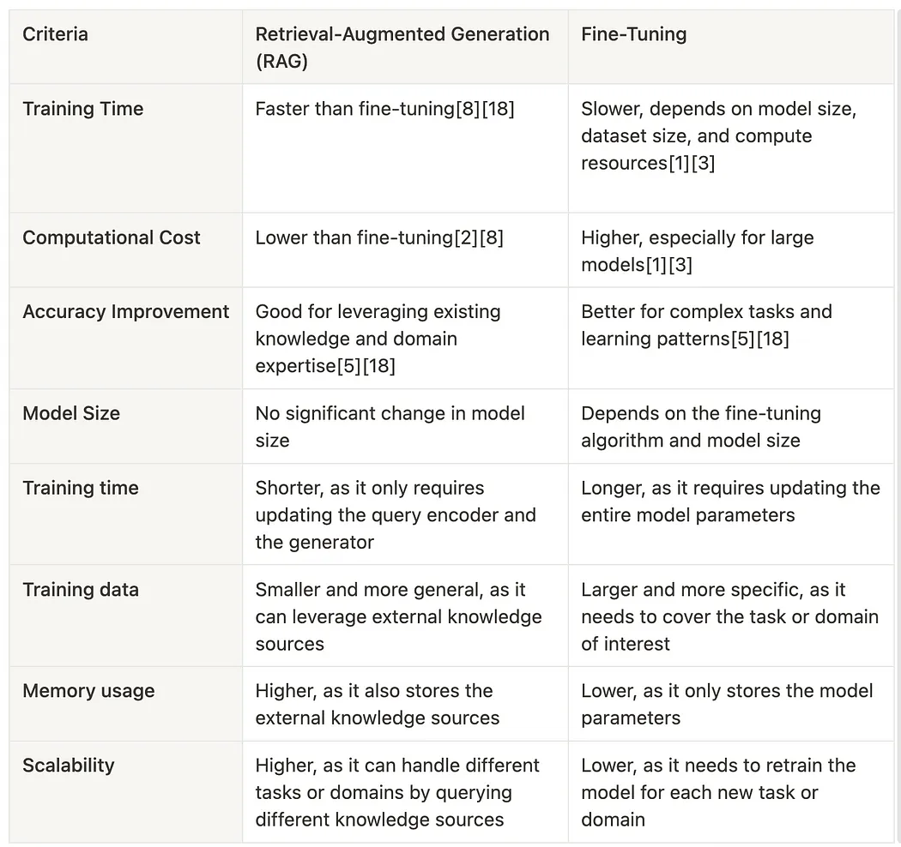

# [Fine-Tuning GPT-3.5 RAG Pipeline with GPT-4 Training Data](https://betterprogramming.pub/fine-tuning-gpt-3-5-rag-pipeline-with-gpt-4-training-data-49ac0c099919)

* GPT-3.5 Turbo
  * https://openai.com/blog/gpt-3-5-turbo-fine-tuning-and-api-updates
* LlamaIndex
  * https://docs.llamaindex.ai/en/stable/examples/finetuning/openai_fine_tuning.html (REALIZAR ESTA PRUEBA)
  * https://twitter.com/llama_index/status/1694116968008401201
    * https://colab.research.google.com/drive/1NgyCJVyrC2xcZ5lxt2frTU862v6eJHlc?usp=sharing

## RAG vs Fine-Tuning

## RAG and Fine-Tuning

Automatización de la generación de datos tanto para el conjunto de datos de evaluación como para el conjunto de datos de entrenamiento, utilizando DatasetGenerator.
Evaluación para el modelo base gpt-3.5-turbo antes del ajuste fino, utilizando el conjunto de datos de evaluación generado en el paso 1.
Construya un motor de consulta de índice vectorial y llame a gpt-4 para recopilar datos de entrenamiento basados ​​en el conjunto de datos de entrenamiento.
El controlador de devolución de llamada OpenAIFineTuningHandlerrecopila todos los mensajes enviados a gpt-4, junto con sus respuestas, y guarda estos mensajes en un .jsonlformato (línea JSON) que puede ser consumido por el punto final de la API de OpenAI para realizar ajustes.
OpenAIFinetuneEnginese construye pasando gpt-3.5-turbo y el jsonlarchivo generado en el paso 4, envía una finetunellamada a OpenAI, lanzando una solicitud de trabajo de ajuste a OpenAI.
OpenAI crea el modelo gpt-3.5-turbo ajustado según su solicitud.
Eval para un modelo ajustado utilizando el conjunto de datos de evaluación generado en el paso 1.
En pocas palabras, esta integración de ajuste permite ajustar gpt-3.5-turbo en los datos de entrenamiento de gpt-4 y generar mejores respuestas.

---

> https://betterprogramming.pub/fine-tuning-your-embedding-model-to-maximize-relevance-retrieval-in-rag-pipeline-2ea3fa231149)

> https://medium.com/@bijit211987/fine-tuning-and-rag-tailoring-language-models-to-your-needs-69ca9e1c2c70

> https://blog.llamaindex.ai/fine-tuning-embeddings-for-rag-with-synthetic-data-e534409a3971)