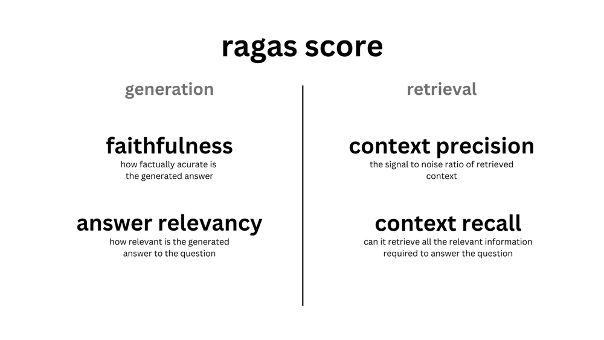

# RAG

Recuperación de generación aumentada (RAG) es una clase de aplicación LLM. El principio básico es aprovechar fuentes de datos externas para brindar a los LLm una referencia contextual. RAG tiene 2 aspectos:

* **Generación:** La generación la realiza el LLM, genera respuestas utilizando la información recuperada.
* **Recuperación:** El recuperador recupera la información relevante.

# Evaluación

Para evaluar los canales RAG, tanto el generador como el recuperador deben evaluarse por separado y juntos para obtener una puntuación general, así como puntuaciones individuales para identificar los aspectos a mejorer.

# RAGAS

[RAGAS Repository](https://github.com/explodinggradients/ragas/tree/main)

[RAGAS Documentation](https://docs.ragas.io/en/latest/index.html)

RAGAS es un marco que ayuda a evaluar las canalizaciones de RAG.

Proporciona las herramientas para evaluar el texto generado por LLM y brindar información sobre el canal RAG.

# Métricas

>https://docs.ragas.io/en/latest/concepts/metrics/index.html

---

>https://medium.aiplanet.com/evaluate-rag-pipeline-using-ragas-fbdd8dd466c1

>https://towardsdatascience.com/evaluating-rag-applications-with-ragas-81d67b0ee31a#c52f

>https://towardsdatascience.com/retrieval-augmented-generation-rag-from-theory-to-langchain-implementation-4e9bd5f6a4f2